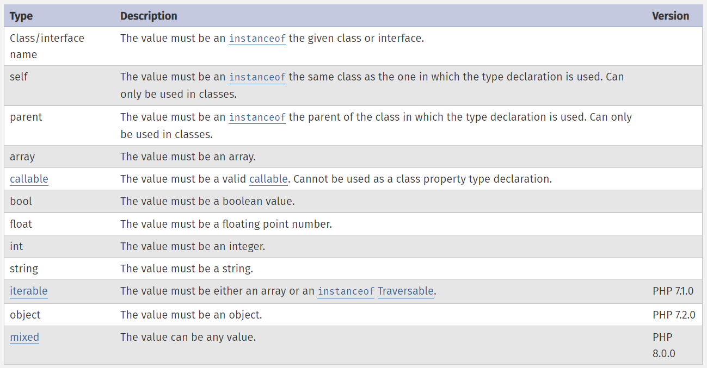

## PHP Data Types

Like other programming languages, PHP provides a series of primitive data types. 

PHP does not require explicit type definition in variable declaration.   

In this case, the type of a variable is determined by the value it stores.   

That is to say, if a string is assigned to variable $var, then $var is of type string. If afterwards an int value is assigned to $var, it will be of type int.


## Define and use different data types

### Scalar primitive types
- bool
- int 
- float
- string

### Compound primitive types
Compound primitive types have compound data structure, and it contains some of scalar data.

- array
- object
- callable
- iterable

### Special primitive types

Special primitive types provide special usages for programmers.

- resources
- NULL


### System pre-defined constant for data types

```php
echo PHP_INT_MAX; //check the maximum representation about int type
echo PHP_FLOAT_MIN;   //check the minimum representation about float type
echo PHP_INT_SIZE; //check the storage bit size about int type

```

### System self-contained functions for data types checking

For example:

```php
<?php
$a = 12;

// function var_dump will return data type and data value both
// this statement will get text "int(12)" as a return value
var_dump($a);

// function gettype will return data type only
// this statement will get text "integer"
gettype($a);

// function is_string will return boolean value
// this statement will get false,because of $a is integer type.
is_string($a);
?>


```


### PHP data type cast

Like other programming languages, PHP defined its type cast rules that control the value transformation between different data types.

There are two kinds of data cast which are "manual data cast" and "automatic data cast".

#### automatic data type cast
- Arithmetic operation with different type of values will execute automatic data type cast.

```php
<?php
/*
 * string will be automatic convert to int or float 
 * that depends on content of the string.
 */
$foo = 1 + "10";  // "10" will be casted to int(10)
$foo = 1 + "10.5"; // "10.5" will be casted to float(10.5)
$foo = 1 + "10.2 Little Piggies";   // will be float(10.2)


/*
 * True will be casted to int(1),
 * False will be casted to int(0).
 */
$foo = 1 + True;   // variable $foo will result in 2 

?>
```

- Division operation will cast the result into float when the result is not still integer.

```php
<?php
// float(3.5714285714286)
var_dump(25/7);         

// if you want integer division
var_dump(intdiv(25,7)); //will get 3
?>
```

- integer overflow will cast it into float data type.

```php
<?php
// int(9223372036854775807) is the biggest number in 64-bit system
$large_number = 9223372036854775807;
var_dump($large_number);       

/*
 * int(9223372036854775808) is over flow
 * and will be casted into float(9.2233720368548E+18)
 */   
$large_number = 9223372036854775808;
var_dump($large_number);                     

?>
```


#### manual data type cast

- use "(type)value" syntax:
   - (int) - cast to int
   - (bool) - cast to bool
   - (float) - cast to float
   - (string) - cast to string
   - (array) - cast to array
   - (object) - cast to object
   - (unset) - cast to NULL


```php
<?php
// use (int)value  to cast value into integer
var_dump((int) (25/7)); // int(3)

// use function intval() to cast value into integer
var_dump((float)("12.011_Hello word"));  // float(12.011)
?>
```

- system predefined function will cast data manually.

```php
<?php
// use function intval() to cast value into integer
var_dump(intval(25/7));  // float(4)
var_dump(strval(110)); //string("110")

// use function settype to cast variables into another data type
$foo = "5bar"; // string
$bar = true;   // boolean
settype($foo, "integer"); // $foo is now 5   (integer)
settype($bar, "string");  // $bar is now "1" (string)
?>
```


#### Rules about casting values to integer type.

1. **Boolean to Integer:** false will yield 0 (zero), and true will yield 1 (one).
2. **Float to Integer:** When converting from float to int, the number will be rounded towards zero.
3. **String to Integer:** If the string is numeric or leading numeric then it will resolve to the corresponding integer value, otherwise it is converted to zero (0).
4. **NaN,null and Infinity to Integer:** NaN,null and Infinity will always be zero when cast to int.

#### Rules about casting values to Float type.

1. **String to Float:** If the string is numeric or leading numeric then it will resolve to the corresponding float 
   value, otherwise it is converted to zero (0).
2. **Other types to Float:** For values of other types, the conversion is performed by converting the value to int first and then to float. See Converting to integer for more information.


#### Rules about casting values to String type.
1. **Boolean to String:** A bool true value is converted to the string "1". bool false is converted to "" (the empty 
   string).
2. **integer and float to string:** An int or float is converted to a string representing the number textually.

#### Rules about casting values to Boolean type.


### Complex data type 


#### Print and Check contents of array, object or resources

Directly converting an array, object, or resource to a string does not provide any useful information about the 
value beyond its type. See the functions print_r() and var_dump() for more effective means of inspecting the contents of these types.

```php
<?php
$a = [1,2,3,4];

//will get "array(4) { [0] => int(1) [1] => int(2) [2] => int(3) [3] => int(4) }"
var_dump($a);

?>
```

### Iterable type

Iterable is a pseudo-type introduced in PHP 7.1. It accepts any array or object implementing the Traversable interface. Both of these types are iterable using foreach and can be used with yield from within a generator.


### Resource type
A resource is a special variable, holding a reference to an external resource. For example, it can hold special 
handles to opened files, database connections, image canvas areas and the like, converting to a resource makes no sense.

### NULL 
The special null value represents a variable with no value. null is the only possible value of type null.

A variable is considered to be null if:
- it has been assigned the constant null.
- it has not been set to any value yet.
- it has been unset().

## Type declarations

Type declarations can be added to function arguments, return values, and, as of PHP 7.4.0, class properties. They ensure that the value is of the specified type at call time, otherwise a TypeError is thrown.

### Table of type declaration keywords




### Declare the basic type of function parameters

```php
<?php
interface I { public function f(); }
class C implements I { public function f() {} }
class D extends C {}

// This doesn't extend C.
class E {}

function f(C $c) {
    echo get_class($c)."\n";
}

function ff(I $i) {
    echo get_class($i)."\n";
}

// works
f(new C);   

// also works due to class D had extends class C
f(new D);   

// works,due to class C had implements interface I
ff(new C);  

// not works, due to class E had not implements interface I   
ff(new E);  
 
// Do not works, because class E has
// no relationships with C or D
f(new E);  
?>
```

### Declare the pass-by-reference parameters

```php
<?php
// pass by reference of array value
function array_baz(array &$param)
{
    $param = 1;
}
$var = [];
array_baz($var);
var_dump($var);  // array $var has been modified
array_baz($var);
?>
```


### Basic return type declaration

```php
<?php

// declare scalar data as return value
function sum($a, $b): float {
    return $a + $b;
}

// Note that a float will be returned.
var_dump(sum(1, 2));


// declare object as return value
class C {}

function getC(): C {
    return new C;
}

var_dump(getC());

?>
```

### Void return type declaration

void is a return type indicating the function does not return a value. Therefore it cannot be part of a union type declaration. Available as of PHP 7.1.0.

```php
<?php
function &test(): void {}
?>
```

### Nullable type
As of PHP 7.1.0, type declarations can be marked nullable by prefixing the type name with a question mark (?). **This 
signifies that the value can be of the specified type or null.**

```php
<?php

//nullable parameters declaration
class C {}

function f(?C $c) {
    var_dump($c);
}
f(new C);
f(null);

//nullable return type declaration
function show(?string $name):?string
{
    var_dump($name);
    return $name;
}
show('自如初');
show(null);


?>
```

#### Union types
A union type declaration accepts values of multiple different simple types, rather than a single one.

```php
<?php
class Person
{
public function __construct(
    public string $name,
    public int $age,
    // hobbies can accept string or array
    public string|array $hobbies  
    )
    {
        $this->name = $name;
        $this->age  = $age;
        $this->hobbies = $hobbies;
    }
}

$p1 = new Person('自如初', 18, 'PHP');
echo $p1->name;
$p2 = new Person('PHP博客', 18, ['vue','js']);
print_r($p2->hobbies);
?>
```