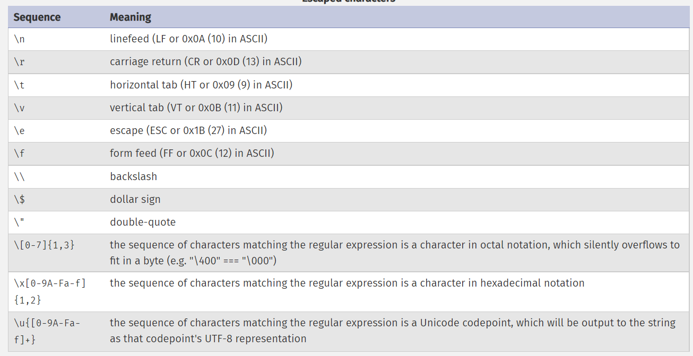

## String

### String representation rules

In php, both single quote and double quote,can represent string values, but there are few differences usages between them.


#### Single quote represented string:

The simplest way to specify a string is to enclose it in single quotes (the character ').
- To specify a literal single quote, escape it with a backslash (\).
- To specify a literal backslash, double it (\\).
- Variable will not be replaced by its values.
- All other instances of backslash will be treated as a literal backslash: this means that the other escape sequences 
  you might be used to, such as\*, \r or \n, will be output literally as specified rather than having any special 
  meaning.

```php
<?php
echo 'this is a simple string';

echo 'You can also have embedded newlines in
strings this way as it is
okay to do';

// Outputs: Arnold once said: "I'll be back"
echo 'Arnold once said: "I\'ll be back"';

// Outputs: You deleted C:\*.*?
echo 'You deleted C:\\*.*?';

// Outputs: You deleted C:\*.*?
echo 'You deleted C:\*.*?';

// Outputs: This will not expand: \n a newline
echo 'This will not expand: \n a newline';

// Outputs: Variables do not $expand $either
echo 'Variables do not $expand $either';
?>
```

#### Double quote represented string:

1. If the string is enclosed in double-quotes ("), PHP will interpret  such as \r or \n, will be output as special 
meaning,For example:




#####  Variable parsing in double quote represented string

1. Using brackets "{}" to include normal variable which will be
   parsing into scalar value, array value or object value.
   
2. Using brackets "{}" to include function which will alse be parsing into a return value of that function.

```php
<?php
$juice = "apple";
$apple = "pearl";
echo "He drank some juice made of {$juice}s.";
echo "He drank some juice made of {${$apple}}";  //variable name of a variable


$juices = array("apple", "orange", "koolaid1" => "purple");
echo "He drank some {$juices[0]} juice.".PHP_EOL;
echo "He drank some {$juices['koolaid1']} juice.".PHP_EOL;

class people {
    public $john = "John Smith";
    public $jane = "Jane Smith";
    public $robert = "Robert Paulsen";
    public $smith = "Smith";
    var $bar = 'I am bar.';
}
$people = new people();
echo "{$people->john} then said hello to {$people->jane}.".PHP_EOL;
$baz = array('foo', 'bar', 'baz');
echo "{$people->{$baz[1]}}";


/*
 * string parses function as return value.
 * syntax "${}" would interpreter inner bracket contents as a variable
 */
echo "This is the value of the var named by the return value of getName(): {${getName()}}";
echo "This is the value of the var named by the return value of \$object->getName(): {${$people->getName()}}";

/*
 * Parsing class static variables in the string
 */

class beers {
    const softdrink = 'rootbeer';
    public static $ale = 'ipa';
}

$rootbeer = 'A & W';
$ipa = 'Alexander Keith\'s';

/*
 * syntax "${}" would interpreter inner bracket contents as a variable
 * class::constant_name and class::$static_name are class static property syntax
 */
echo "I'd like an {${beers::softdrink}}\n";  // This works; outputs: I'd like an A & W
echo "I'd like an {${beers::$ale}}\n";       // This works too; outputs: I'd like an Alexander Keith's
?>
```

### Accessing string as an array

Characters within strings may be accessed and modified by specifying the zero-based offset of the desired character after the string using square array brackets, as in $str[42].

```php
<?php
// Get the first character of a string
$str = 'This is a test.';
$first = $str[0];

// Get the third character of a string
$third = $str[2];

// Get the last character of a string.
$str = 'This is still a test.';
$last = $str[strlen($str)-1];

// Modify the last character of a string
$str = 'Look at the sea';
$str[strlen($str)-1] = 'e';

?>
```

### Operations on array

Strings may be concatenated using the '.' (dot) operator. Note that the '+' (addition) operator will not work for this.

```php
<?php
$a = "Hello ";
$b = $a . "World!"; // now $b contains "Hello World!"

$a = "Hello ";
$a .= "World!";     // now $a contains "Hello World!"
?>
```


### Functions on array

The functions substr() and substr_replace() can be used when you want to extract or replace more than 1 character.

```php
substr("hello world!",3);

substr_replace("hello world!","aaaa",2);
```