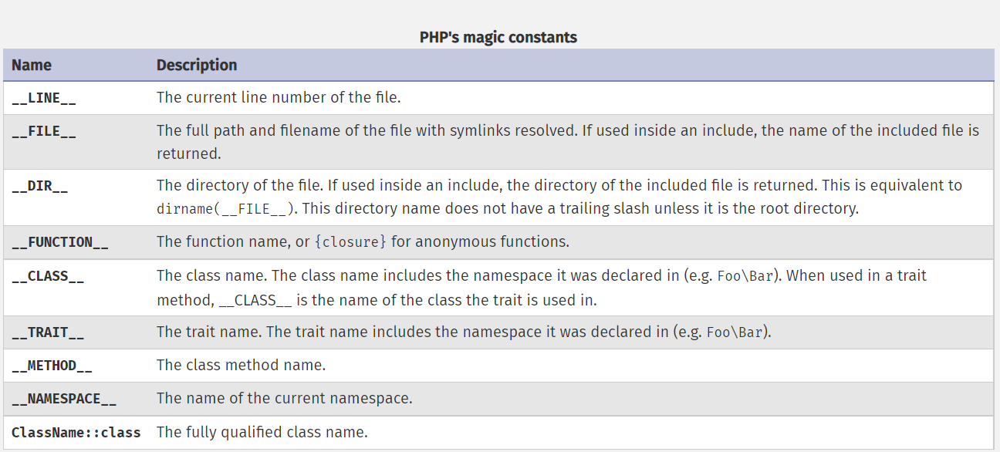

# Constants

A constant is an identifier (name) for a simple value. As the name suggests, that value cannot change during the execution of the script (except for magic constants, which aren't actually constants).

Constants are case-sensitive. By convention, constant identifiers are always uppercase.

```php
<?php
// const definition example
const MIN_VALUE = 0.0;       
const MAX_VALUE = 1.0;        
?>
```

### PHP pre-defined constants

PHP provides a large number of predefined constants to any script which it runs. Many of these constants, however, are created by various extensions, and will only be present when those extensions are available, either via dynamic loading or because they have been compiled in.

```php
//
echo PHP_VERSION;
echo E_ERROR;
```

### PHP magic constants

There are nine magical constants that change depending on where they are used. For example, the value of __LINE__ depends on the line that it's used on in your script.

