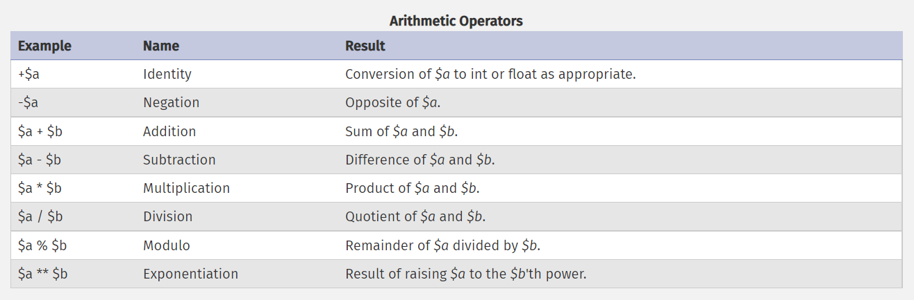
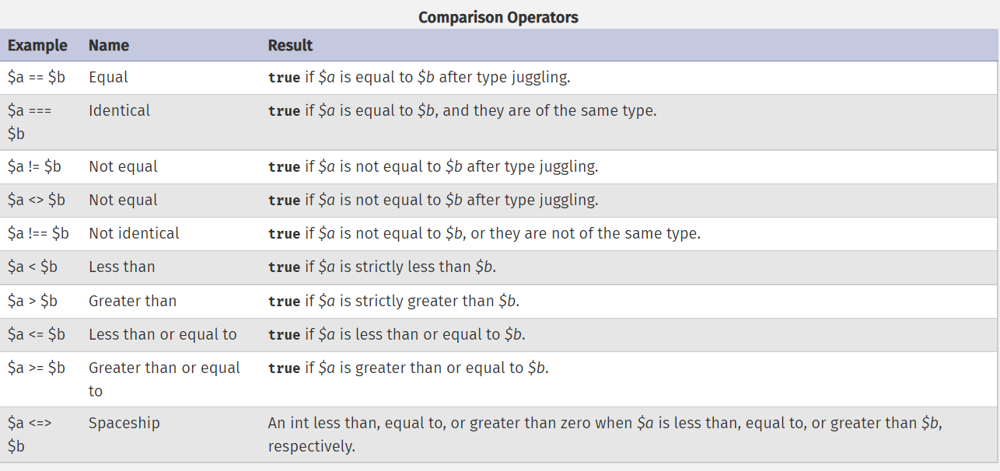
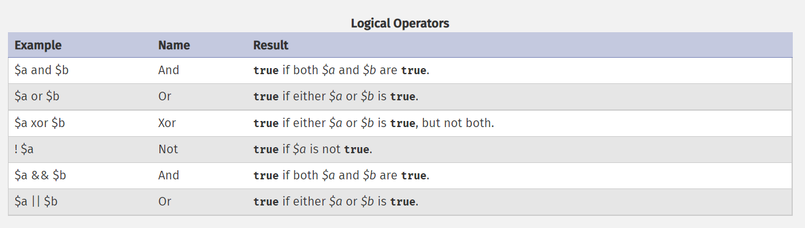
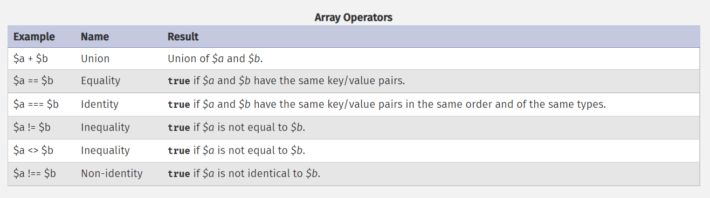

# Expression&Operators

The most basic forms of expressions are constants and variables. When you type $a = 5, you're assigning 5 into $a. 5, obviously, has the value 5, or in other words 5 is an expression with the value of 5 .so if you wrote $b = $a,In other words, $a is an expression with the value of 5 as well.

### php is an expression-oriented language.

In PHP, almost everything is an expression. 

For example, $a = 5. It's easy to see that there are two values involved here, the value of the integer constant 5, and the value of $a which is being updated to 5 as well. But the truth is that there's one additional value involved here, and that's the value of the assignment itself. The assignment itself evaluates to the assigned value, in this case 5. 

In practice, it means that $a = 5, regardless of what it does, is an expression with the value 5. Thus, writing something like $b = ($a = 5) is like writing $a = 5; $b = 5; (a semicolon marks the end of a statement). Since assignments are parsed in a right to left order, you can also write $b = $a = 5.


## Operators

### Arithmetic operators


### Comparison operators


### Error Control Operators
PHP supports one error control operator: the at sign (@). When prepended to an expression in PHP, any diagnostic error that might be generated by that expression will be suppressed.
```php
<?php
/* Intentional file error */
$my_file = @file ('non_existent_file') or
    die ("Failed opening file: error was '" . error_get_last()['message'] . "'");

// this works for any expression, not just functions:
$value = @$cache[$key];
// will not issue a notice if the index $key doesn't exist.

?>
```

### Logical operators


### String operators

```php
<?php
$a = "Hello ";
$b = $a . "World!"; // now $b contains "Hello World!"

$a = "Hello ";
$a .= "World!";     // now $a contains "Hello World!"
?>
```

### Array operators

