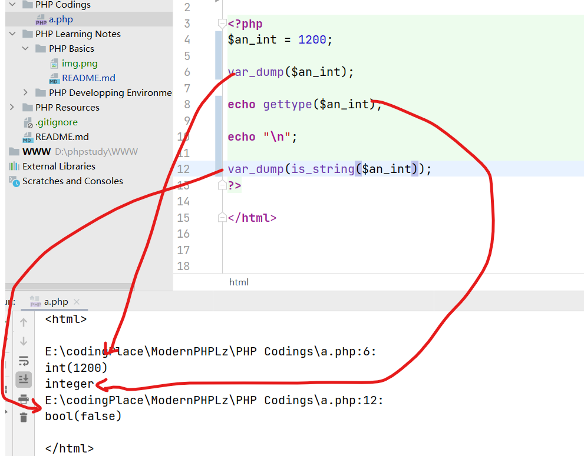
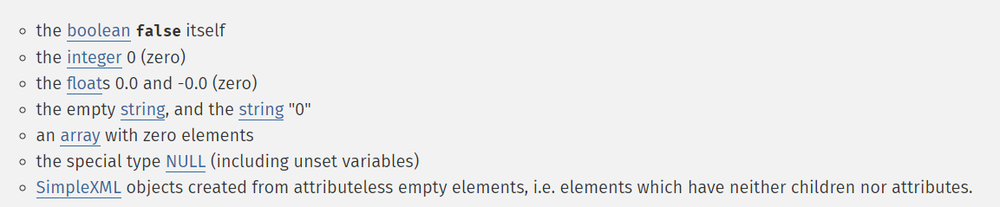
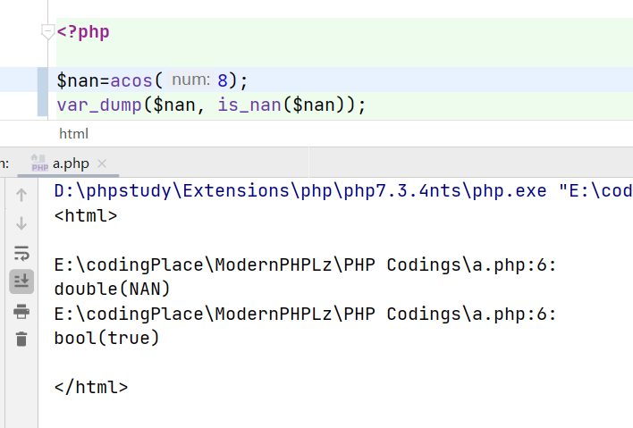
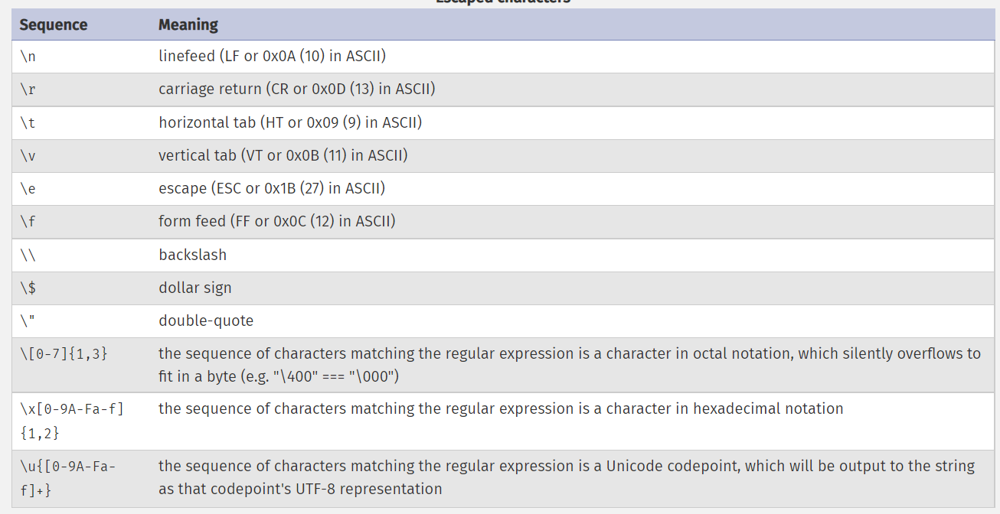
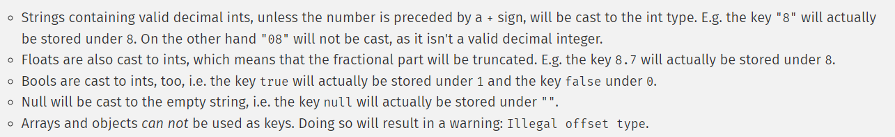

# PHP programming basics

## php tags

### php normal tags syntax
In normal, we would use ```<?php   ?>``` paired tags to include php codes, for example:
```php
<?php 
    echo 'While this is going to be parsed.'; 
?>

```

### Embedded PHP codes in HTML codes with PHP tages

Everything outside of a pair of opening and closing tags is ignored by the PHP parser which allows PHP to be embedded in HTML documents.

For example:

- The PHP interpreter hits the ?> closing tags, it simply starts outputting whatever it finds, until it hits another opening tag: 
```php
<?php echo 'While this is going to be parsed.'; ?>
<p>This will also be ignored by PHP and displayed by the browser.</p>
```

- php tags can also skip text when interpreter meets function definition syntax.

```html
<html>
<?php
function show($a) {
    ?>
    <a href="https://www.<?php echo $a ?>.com">
    Link
    </a>
    <?php
}
?>
<body>
    <?php show("google") ?>
</body>
</html>
```

- Embedded PHP conditional statements and control statements have special embedding rules. You should consider the entire conditional statements and control statements as one block. The interpreter will determine the outcome of the conditional, and decide which small block would be skipped over.

```html
<!--Take entire if-else-endif statements as a big block -->
<!--The interpreter will determine the statements outcome and decide to skip any small blocks -->
<?php if (1 == true): ?>
    This will be not skipped,because the expression is true.
<?php else: ?>
    This will be skipped,because the if statements is true.
<?php endif; ?>


<!--Take entire For statements as a big block -->
<?php for ($i = 0; $i < 5; ++$i): ?>
Hello, there!
<?php endfor; ?>
```

## PHP Comments

### one line comment
For example:

```php
<?php

// Control
echo microtime(), "<br />"; // 0.25163600 1292450508
echo microtime(), "<br />"; // 0.25186000 1292450508
?>

```

### Multi-line comment

```php
<?php
/**
* The second * here opens the DocBook commentblock, which could later on<br>
* in your development cycle save you a lot of time by preventing you having to rewrite<br>
* major documentation parts to generate some usable form of documentation.
*/
?>
```

## PHP Data Types

Like other programming languages, PHP provides a series of primitive data types

### Scalar primitive types
- bool: True, False

```php
<?php
$foo = True; // assign the value TRUE to $foo
?>
```

- int: binary integer(base 2), octal integer(base 8), decimal integer(base 10), hex integer(base 16).

```php
<?php
$a = 1234; // decimal number
$a = 0123; // octal number (equivalent to 83 decimal)
$a = 0x1A; // hexadecimal number (equivalent to 26 decimal)
$a = 0b11111111; // binary number (equivalent to 255 decimal)
?>
```

- float
- string

### Compound primitive types
Compound primitive types have compound data structure, and it contains some of scalar data.

- array
- object
- callable
- iterable

### Special primitive types

Special primitive types provide special usages for programmers.

- resources
- NULL

### Check predefined data size about scalar data type

```php
echo PHP_INT_MAX; //check the maximum representation about int type
echo PHP_FLOAT_MIN;   //check the minimum representation about float type
echo PHP_INT_SIZE; //check the storage bit size about int type
```


### Type check function

var_dump will return data type and value of special variable.

gettype will only return data type of special variable.

is_xx will check the type of special variable, it returns 1 if it's true, it returns 0 in contrast.




### PHP type cast rules:

Data converts to bool:


Data converts to int:

```php
<?php
var_dump(25/7);         // float(3.5714285714286)
var_dump((int) (25/7)); // int(3)
var_dump(intval(25/7));  // float(4)

/*
 * The rule of string convert to numeric data type like int or float
 */
$foo = 1 + "10.5";                // $foo is float (11.5)
$foo = 1 + "-1.3e3";              // $foo is float (-1299)
$foo = 1 + "bob-1.3e3";           // TypeError as of PHP 8.0.0, $foo is integer (1) previously
$foo = 1 + "bob3";                // TypeError as of PHP 8.0.0, $foo is integer (1) previously
$foo = 1 + "10 Small Pigs";       // $foo is integer (11) and an E_WARNING is raised in PHP 8.0.0, E_NOTICE previously
$foo = 4 + "10.2 Little Piggies"; // $foo is float (14.2) and an E_WARNING is raised in PHP 8.0.0, E_NOTICE previously
$foo = "10.0 pigs " + 1;          // $foo is float (11) and an E_WARNING is raised in PHP 8.0.0, E_NOTICE previously
$foo = "10.0 pigs " + 1.0;        // $foo is float (11) and an E_WARNING is raised in PHP 8.0.0, E_NOTICE previously
?>
```


### Type Manual Cast

- The casts Syntax allowed are:
    - (int) - cast to int
    - (bool) - cast to bool
    - (float) - cast to float
    - (string) - cast to string
    - (array) - cast to array
    - (object) - cast to object
    - (unset) - cast to NULL
    
For example:

```php
<?php
$foo = 10;   // $foo is an integer
$bar = (bool) $foo;   // $bar is a boolean
?>
```

Otherwise, you can use function ```settype``` to cast data type:

```php
<?php
$foo = "5bar"; // string
$bar = true;   // boolean

settype($foo, "integer"); // $foo is now 5   (integer)
settype($bar, "string");  // $bar is now "1" (string)
?>
```

### Type automatic cast


### Float variable comparisons

To test floating point values for equality, an upper bound on the relative error due to rounding is used. This value is known as the machine epsilon, or unit roundoff, and is the smallest acceptable difference in calculations.

For example, $a and $b are equal to 5 digits of precision. 

```php
<?php
$a = 1.23456789;
$b = 1.23456780;
$epsilon = 0.00001;

if(abs($a-$b) < $epsilon) {
    echo "true";
}
?>
```

### NAN value in float data type

Some numeric operations can result in a value represented by the constant NAN. This result represents an undefined or unrepresentable value in floating-point calculations. 

Because NAN represents any number of different values, NAN should not be compared to other values, including itself, and instead should be checked for using is_nan().

For example:




### String representation rules

In php, both single quote and double quote,can represent string values, but there are few differences usages between them. 


1. Single quote represented string:
   - The simplest way to specify a string is to enclose it in single quotes (the character '). To specify a literal single quote, escape it with a backslash (\). To specify a literal backslash, double it (\\). All other instances of backslash will be treated as a literal backslash: this means that the other escape sequences you might be used to, such as \r or \n, will be output literally as specified rather than having any special meaning.
  
```php
<?php
echo 'this is a simple string';

echo 'You can also have embedded newlines in
strings this way as it is
okay to do';

// Outputs: Arnold once said: "I'll be back"
echo 'Arnold once said: "I\'ll be back"';

// Outputs: You deleted C:\*.*?
echo 'You deleted C:\\*.*?';

// Outputs: You deleted C:\*.*?
echo 'You deleted C:\*.*?';

// Outputs: This will not expand: \n a newline
echo 'This will not expand: \n a newline';

// Outputs: Variables do not $expand $either
echo 'Variables do not $expand $either';
?>
```

2. Double quote represented string:
   - If the string is enclosed in double-quotes ("), PHP will interpret  such as \r or \n, will be output as special meaning,For example:
  



### PHP array date type

- What is array in php, how it's implemented?
    - An array in PHP is actually an ordered map. A map is a type that associates values to keys. 
      
- The usages about array in PHP
    - This type is optimized for several different uses;.
    - It can be treated as an array, list (vector), hash table (an implementation of a map), dictionary, collection, stack, queue, and probably more.
    

- Syntax for about using array
    - The key can either be an int or a string. The value can be of any type.

```php
<?php
/*
 * 
 */
$array = array(
    "foo" => "bar",
    1 => "foo",
);

// Using the short array syntax
$array = [
    "foo" => "bar",
    "bar" => "foo",
];


?>
```

- Rule for key value casts:

  
```php
<?php
/*
 * "1",1.5,true are all casted to int(1),hence $array will only has 1=>"d" data.
 */
$array = array(
    1    => "a",
    "1"  => "b",
    1.5  => "c",
    true => "d",
);
var_dump($array);
?>
```

