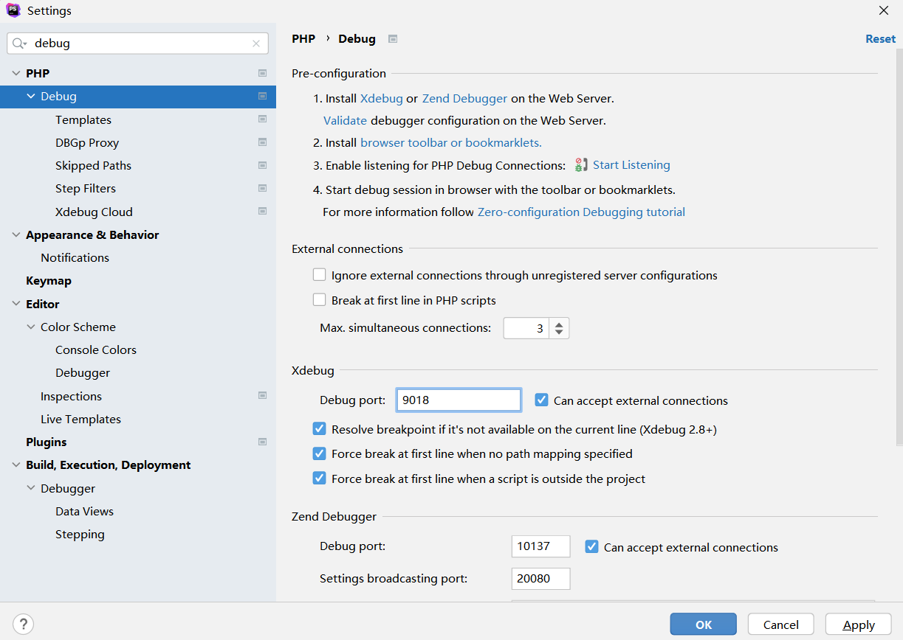

# PHP Developping Environment

## Configuring Phpstorm

### PHP cli interpreter configuration

The cli interpreter is a command line interpreter. With a command line interpreter, we can run and debug php files in terminals.

The Configuration pages about cli interpreter:


The php cli interpreter run command page, simply we run ```php.exe a.php```


### php built-in webserver configuration

The built-in webserver is a phpstorm tool which can deploy and debug php code on built-in webserver.Please configure it like:


The php built-in webserver running sample, simply using command like ```php.exe -S localhost:80  root_directory```:


### php xdebug configuration
Firstly, add new configuring lines in php.ini file.
The most important configurations is :
- xdebug.remote_port
- xdebug.remote_enable=On
- xdebug.remote_host="127.0.0.1"


Check Xdebug is open through phpinfo(), like:


Secondly, configuring the xdebug port in phpstorm:



Lastly, add php web-page run-time configuration:


Set any breakpoints you want, and open the browser, the xdebug will be awake.


Tips:  
Set max_execute_time in php.ini will help you to prevent gateway time exceed error through xdebug:


